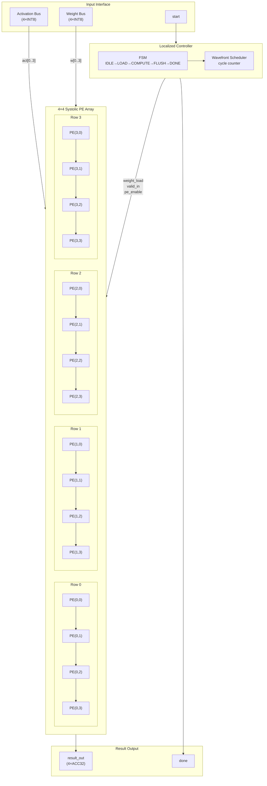
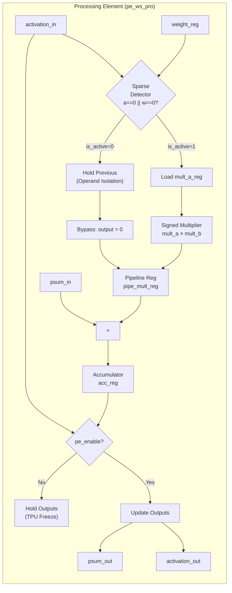
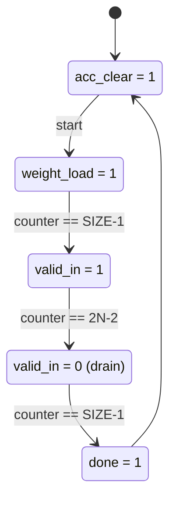
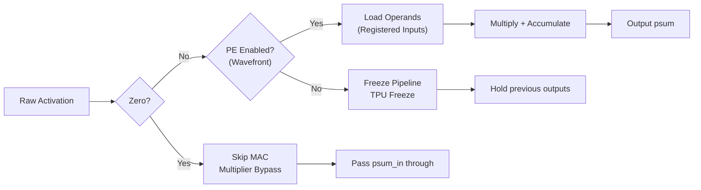

# Architecture Diagrams

## System Block Diagram

```mermaid
flowchart TB
    subgraph Input["Input Interface"]
        ACT["Activation Bus<br/>(4×INT8)"]
        WGT["Weight Bus<br/>(4×INT8)"]
        START["start"]
    end

    subgraph Controller["Localized Controller"]
        FSM["FSM<br/>IDLE→LOAD→COMPUTE→FLUSH→DONE"]
        WF["Wavefront Scheduler<br/>cycle counter"]
        FSM --> WF
    end

    subgraph Array["4×4 Systolic PE Array"]
        direction LR
        subgraph Row0["Row 0"]
            PE00["PE(0,0)"] --> PE01["PE(0,1)"] --> PE02["PE(0,2)"] --> PE03["PE(0,3)"]
        end
        subgraph Row1["Row 1"]
            PE10["PE(1,0)"] --> PE11["PE(1,1)"] --> PE12["PE(1,2)"] --> PE13["PE(1,3)"]
        end
        subgraph Row2["Row 2"]
            PE20["PE(2,0)"] --> PE21["PE(2,1)"] --> PE22["PE(2,2)"] --> PE23["PE(2,3)"]
        end
        subgraph Row3["Row 3"]
            PE30["PE(3,0)"] --> PE31["PE(3,1)"] --> PE32["PE(3,2)"] --> PE33["PE(3,3)"]
        end
    end

    subgraph Output["Result Output"]
        RES["result_out<br/>(4×ACC32)"]
        DONE["done"]
    end

    ACT -->|"act[0..3]"| Array
    WGT -->|"w[0..3]"| Array
    START --> Controller
    Controller -->|"weight_load<br/>valid_in<br/>pe_enable"| Array
    Controller --> DONE
    Array --> RES
```

## PE Internal Block Diagram

```mermaid
flowchart TB
    subgraph PE["Processing Element (pe_ws_pro)"]
        direction TB

        ACT_IN["activation_in"] --> SPARSE{"Sparse<br/>Detector<br/>a==0 || w==0?"}
        W_REG["weight_reg"] --> SPARSE

        SPARSE -->|"is_active=1"| MUX_A["Load mult_a_reg"]
        SPARSE -->|"is_active=0"| HOLD["Hold Previous<br/>(Operand Isolation)"]

        MUX_A --> MULT["Signed Multiplier<br/>mult_a × mult_b"]
        HOLD --> BYPASS["Bypass: output = 0"]

        MULT --> PIPE["Pipeline Reg<br/>pipe_mult_reg"]
        BYPASS --> PIPE

        PSUM_IN["psum_in"] --> ADD["+"]
        PIPE --> ADD

        ADD --> ACC["Accumulator<br/>acc_reg"]

        PE_EN{"pe_enable?"} -->|"Yes"| OUT_UPD["Update Outputs"]
        PE_EN -->|"No"| OUT_HOLD["Hold Outputs<br/>(TPU Freeze)"]

        ACC --> PE_EN
        ACT_IN --> PE_EN

        OUT_UPD --> ACT_OUT["activation_out"]
        OUT_UPD --> PSUM_OUT["psum_out"]
    end
```

## Wavefront Scheduling Timeline

```mermaid
gantt
    title PE Activation Timeline (4×4 Systolic Array)
    dateFormat X
    axisFormat %s

    section PE(0,0)
    Active : 0, 4
    section PE(0,1)
    Active : 1, 5
    section PE(0,2)
    Active : 2, 6
    section PE(0,3)
    Active : 3, 7
    section PE(1,0)
    Active : 1, 5
    section PE(1,1)
    Active : 2, 6
    section PE(1,2)
    Active : 3, 7
    section PE(1,3)
    Active : 4, 8
    section PE(2,0)
    Active : 2, 6
    section PE(2,1)
    Active : 3, 7
    section PE(2,2)
    Active : 4, 8
    section PE(2,3)
    Active : 5, 9
    section PE(3,0)
    Active : 3, 7
    section PE(3,1)
    Active : 4, 8
    section PE(3,2)
    Active : 5, 9
    section PE(3,3)
    Active : 6, 10
```

## Controller FSM

```mermaid
stateDiagram-v2
    [*] --> IDLE
    IDLE --> LOAD_WEIGHT : start
    LOAD_WEIGHT --> COMPUTE : counter == SIZE-1
    COMPUTE --> FLUSH : counter == 2N-2
    FLUSH --> FINISH : counter == SIZE-1
    FINISH --> IDLE

    IDLE : acc_clear = 1
    LOAD_WEIGHT : weight_load = 1
    COMPUTE : valid_in = 1
    FLUSH : valid_in = 0 (drain)
    FINISH : done = 1
```

## Power Optimization Flow

```mermaid
flowchart LR
    A["Raw Activation"] --> B{"Zero?"}
    B -->|"Yes"| C["Skip MAC<br/>Multiplier Bypass"]
    B -->|"No"| D{"PE Enabled?<br/>(Wavefront)"}
    D -->|"No"| E["Freeze Pipeline<br/>TPU Freeze"]
    D -->|"Yes"| F["Load Operands<br/>(Registered Inputs)"]
    F --> G["Multiply + Accumulate"]
    G --> H["Output psum"]
    C --> I["Pass psum_in through"]
    E --> J["Hold previous outputs"]
```
